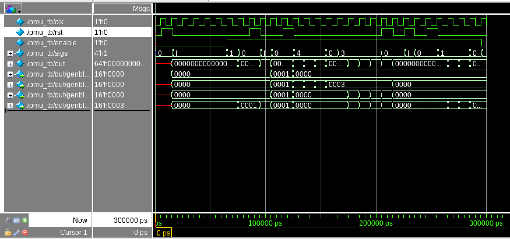

# Micro-Architecture Performance Monitor (PMU)

## Project Overview

This project is a parameterizable Micro-Architecture Performance Monitor (PMU) written in SystemVerilog. The goal of the design was to build a reusable hardware block that can monitor multiple event signals and keep track of them using separate counters. This kind of logic can be useful in a processor or digital system when trying to track how often certain events happen during execution, such as stalls, branch-related activity, hazards, cache-related events, or any other internal signals chosen by the designer.

Instead of making one fixed counter design, this project was built to be scalable. The number of monitored events and the width of each counter can both be changed through parameters, which makes the PMU more reusable and easier to adapt to different systems.

The project was developed in the UMass VLSI CAD environment and verified using ModelSim. Functional behavior was checked through directed testbench simulation, waveform analysis, and SystemVerilog assertion-based checks.

---

## Purpose of the Project

The main reason for doing this project was to get stronger in RTL design and digital verification by building something that is small enough to finish but still meaningful from a micro-architecture point of view.

This project helped me work on:

- writing clean SystemVerilog RTL
- building a parameterized and scalable hardware module
- using generate blocks and modular hierarchy
- writing a directed testbench
- debugging with waveforms in ModelSim
- adding assertion-based checks to catch design mistakes
- organizing a project in a more professional hardware design style

The bigger idea behind the project is that performance monitoring logic is not just random counter logic. It is support logic that can help observe what is happening inside a design, which makes it relevant to processor-oriented and system-level digital work.

---

## PMU Function

At a high level, the PMU takes in a vector of event signals. Each event signal is connected to its own counter. When the PMU is enabled, any event bit that is high at the rising edge of the clock causes its matching counter to increment by one. When reset is asserted, all counters clear back to zero.

The PMU output is a packed bus that contains all counter values together. Each slice of that bus corresponds to one monitored event.

This creates a simple monitoring structure where events are counted independently and the whole design stays scalable through parameters.

---

## Design Features

The PMU includes the following features:

- parameterizable number of monitored events
- parameterizable counter width
- one counter per event
- synchronous counting on the rising edge of the clock
- synchronous reset behavior
- global enable signal for gating counting activity
- packed output bus containing all counter values
- counter saturation behavior at max value instead of wraparound
- assertion-based checks for important design behaviors

---

## Files in This Project

### `rtl/counter.sv`
This is the reusable counter module used by the PMU. It increments when both `enable` and `sigevent` are high on the rising edge of the clock. If reset is high, it clears to zero. The counter also saturates at its maximum value instead of wrapping around.

### `rtl/pmu.sv`
This is the top-level PMU module. It instantiates one counter per event using a generate loop. The outputs of those counters are stored internally and then packed into a single output vector.

### `tb/pmu_tb.sv`
This is the directed testbench used for simulation. It applies different event patterns and checks that the PMU behaves correctly across reset, enable gating, independent counting, simultaneous counting, and reset priority cases.

### `results/waveforms/`
This folder stores waveform screenshots taken from ModelSim to document important verification results.

---

## Parameterization

The PMU currently uses these main parameters:

- `TOTAL_EVENTS` – number of independent event signals being monitored
- `COUNTER_DEPTH` – width of each counter in bits

For the testbench and main verification setup used in this project:

- `TOTAL_EVENTS = 4`
- `COUNTER_DEPTH = 16`

So in the current version, the PMU monitors 4 event signals and each one has its own 16-bit counter.

---

## Top-Level Interface

### Inputs

- `clk` – system clock
- `rst` – synchronous reset
- `enable` – global enable for counting
- `signals[TOTAL_EVENTS-1:0]` – vector of monitored event inputs

### Output

- `finalcntr[TOTAL_EVENTS*COUNTER_DEPTH-1:0]` – packed vector containing all event counter values

For the 4-event, 16-bit setup used in simulation:

- `finalcntr[15:0]` = counter for event 0
- `finalcntr[31:16]` = counter for event 1
- `finalcntr[47:32]` = counter for event 2
- `finalcntr[63:48]` = counter for event 3

---

## Design Behavior

The PMU was designed around the following expected behaviors:

1. When reset is asserted, all counters return to zero.
2. When `enable` is low, counters do not increment even if event signals are active.
3. Each event only affects its own matching counter.
4. Multiple event signals can be counted in the same cycle.
5. Reset has priority over counting logic.
6. Counters should stop incrementing once they reach their maximum value.

These behaviors were used to guide both the directed testbench and the assertion checks.

---

## RTL Design Notes

The design is organized hierarchically using a reusable `counter` module and a top-level `pmu` module.

The `counter` module handles the actual increment logic. It only increments when both `enable` and `sigevent` are high. It also clears on reset and saturates at the maximum value.

The `pmu` module takes a vector of event signals and creates one counter instance per event using a generate loop. This makes the design more scalable than hardcoding separate counters manually. Internally, each counter output is stored in an array and then packed into the final PMU output bus.

This organization keeps the RTL compact while still showing modularity, parameterization, and clean top-level structure.

---

## Verification Strategy

The PMU was verified in ModelSim using a directed SystemVerilog testbench. The testbench was written to check the main functional behaviors of the PMU step by step instead of only running one simple case.

The verification process focused on applying known input patterns, observing the resulting counter activity, and checking whether the output matched the expected PMU behavior.

The following cases were tested:

### Test 1 – Reset clears all counters
Reset was asserted and the testbench checked that all counters returned to zero.

### Test 2 – Enable gating
All event inputs were driven high while `enable` remained low. The expected result was that no counter should increment.

### Test 3 – Single-event counting
A single event bit was asserted for one clock cycle while `enable` was high. The expected result was that only the corresponding counter should increment to 1.

### Test 4 – Simultaneous multi-event counting
All event bits were asserted together for one clock cycle. The expected result was that all counters should increment together.

### Test 5 – Counter independence
Only one event bit was asserted for multiple cycles. The expected result was that only the matching counter should increment while the others remained unchanged.

### Test 6 – Reset during active counting
Counters were first allowed to increment, then reset was asserted during the counting sequence. The expected result was that all counters should clear back to zero.

### Test 7 – Reset priority over event activity
Reset and active event inputs were applied in the same cycle. The expected result was that reset should win and the counters should stay at zero.

### Test 8 – Counter freeze when enable goes low
A counter was incremented first, then `enable` was dropped while the same event stayed active. The expected result was that the counter should hold its previous value and stop changing.

---

## Assertion-Based Checks

In addition to the directed testbench, SystemVerilog assertion-based checks were added into the counter module to strengthen verification.

These checks were used to confirm important design rules such as:

- the counter never goes past its maximum value
- reset correctly clears the counter
- the counter does not change when `enable` is low
- the counter stays at max value instead of wrapping when another event arrives at saturation

These assertions were run in ModelSim using a command-line flow without the GUI. This made it easier to quickly check assertion behavior without having to repeatedly work through the full remote GUI environment.

Adding these checks helped make the verification stronger because it was not only based on looking at waveforms manually. The design was also being checked against specific expected behaviors during simulation.

---

## Simulation Flow

Simulation was run in ModelSim. The main flow used in this project was:

1. compile `counter.sv`, `pmu.sv`, and `pmu_tb.sv`
2. launch the testbench in ModelSim
3. run the simulation
4. inspect waveform behavior for reset, enable, event inputs, packed outputs, and internal counters
5. review directed test results from the testbench output
6. run assertion-based checks in command-line simulation

This allowed both visual verification through waveforms and behavior checking through assertions.

---

## Waveform Results

Waveform inspection was used as visual confirmation that the PMU behaved correctly during simulation. The ModelSim traces showed the expected response of the PMU under reset, enable gating, event activity, and repeated counting conditions.

Some of the main observations from the waveform review were:

- counters returned to zero whenever reset was asserted
- event signals did not cause counting when `enable` was low
- a single asserted event incremented only its matching counter
- multiple asserted events incremented their matching counters in the same cycle
- repeated assertion of one event signal caused only that one counter to accumulate counts
- counters held their value correctly when counting conditions were not met
- reset overrode event-driven counting when both occurred together

### Full Simulation Overview

The full simulation waveform gives a complete view of the directed PMU verification sequence across multiple tests in one run. It captures the progression through reset, enable gating, single-event counting, simultaneous counting, independent counting, and later reset-related tests.

*Full ModelSim waveform overview showing the complete PMU verification sequence across the directed testbench scenarios.*

### Enable-Gating Result

One important check in the project was making sure active event inputs do not affect the PMU when counting is disabled. In the waveform below, `enable = 0` while `sigs = 4'b1111`, and all counters remain at `0000`. This confirms that the global enable signal is correctly gating the counter activity.

*Enable-gated counting behavior in ModelSim. With `enable = 0` and `sigs = 4'b1111`, all PMU counters remain at zero, confirming that event activity does not increment counters when counting is disabled.*

### Independent Counter Result

The independent counting test was one of the clearest checks of PMU correctness. In this case, only one event input was asserted for multiple clock cycles while the PMU remained enabled. The waveform shows that only the corresponding counter increments across successive cycles, while the other counters remain unchanged.

*Independent event counting in ModelSim. With `sigs = 4'b0100` held active for three clock cycles while `enable = 1`, only the corresponding counter increments from 1 to 3, while the other counters remain unchanged.*

---

## What This Project Demonstrates

This project demonstrates a full small-scale RTL design and verification flow around a reusable hardware monitoring block. Even though the PMU itself is not a massive design, it brings together several important digital design ideas in one project:

- modular RTL design
- parameterization and scalability
- generate-based structural design
- directed simulation-based verification
- waveform debugging
- assertion-based checking
- project organization and documentation

This kind of block is also the type of support logic that fits naturally around larger processor, controller, or digital subsystem designs where visibility into internal events matters.

---

## Current Status

At this stage, the RTL implementation, directed simulation, waveform documentation, and assertion-based verification have all been completed.

The current version of the project focuses on functional correctness at the RTL level. A possible future extension would be adding synthesis and implementation analysis, or extending the PMU interface with more advanced readout or control features.

---

## Possible Future Improvements

Some possible extensions for later versions of the project are:

- per-event enable masking
- overflow flag support
- register-style read interface instead of only a packed output bus
- synthesis and design compiler analysis
- more advanced concurrent assertion properties
- additional event types and larger PMU configurations

---

## Tools Used

- SystemVerilog
- ModelSim
- UMass VLSI CAD environment

---

## Author Note

This project was built as a digital design and verification exercise focused on micro-architecture-oriented monitoring logic. The main goal was not just to make counters work, but to build the design in a reusable way, verify it carefully, and document the results clearly.