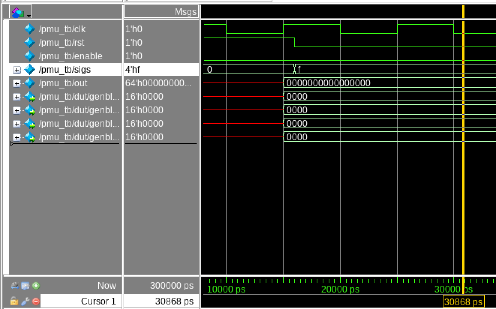
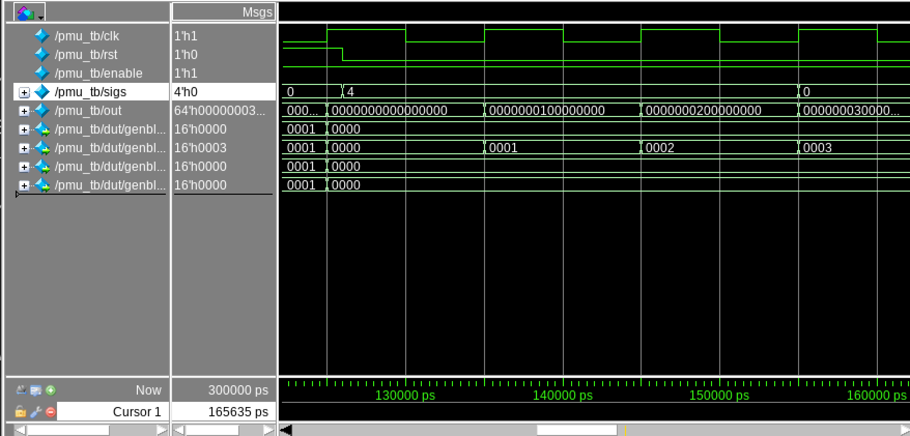

# Micro-Architecture Performance Monitor(PMU)

## Project Overview

This project implements a parameterizable Micro-Architecture Performance Monitor (PMU) in SystemVerilog. The goal of the design is to create a reusable hardware block that can monitor multiple event signals and maintain a separate counter for each one. The PMU is intended to represent the kind of support logic that would be useful in a processor or digital system for tracking runtime behavior such as stalls, branch activity, cache-related events, or other internal signals.

Rather than building a fixed single-purpose counter, this project focuses on scalability and reuse. The design allows the number of monitored events and the width of the counters to be adjusted through parameters, making the PMU flexible enough to adapt to different use cases.

This project was developed and simulated in the UMass VLSI CAD environment using ModelSim as part of a digital RTL design flow.

---

## Project Goals

The main goals of this project are:

- design a clean and reusable RTL block in SystemVerilog
- create a PMU that can monitor multiple independent event signals
- verify correct functionality through simulation in ModelSim
- document the design and verification flow in a professional way
- build a project that is relevant to digital design and micro-architecture work

---

## PMU Function

At a high level, the PMU monitors a vector of event signals. Each event signal is connected to its own dedicated counter. When the PMU is enabled, any event bit that is high at the active clock edge causes its corresponding counter to increment by one. When reset is asserted, all counters are cleared back to zero.

This creates a simple but scalable monitoring structure where each event is counted independently.

---

## Design Features

The PMU includes the following features:

- parameterizable number of monitored events
- parameterizable counter width
- one counter per event
- synchronous counting on the rising edge of the clock
- reset support to clear all counters
- global enable control to gate counting activity
- packed output bus containing all counter values

The design is organized hierarchically using a reusable `counter` module and a top-level `pmu` module that instantiates one counter for each monitored event.

---

## Module Structure

### 1. `counter.sv`

The `counter` module is the basic building block of the PMU. It increments only when both `enable` and `sigevent` are high at the rising edge of the clock. If reset is asserted, the counter is cleared to zero.

This module is parameterized by counter width so it can be reused for different PMU configurations.

### 2. `pmu.sv`

The `pmu` module is the top-level monitoring block. It accepts a vector of event signals and creates one `counter` instance per event using a generate loop. Each counter output is stored internally and then packed into a single output vector.

This organization keeps the design scalable and avoids hardcoding a separate counter output for each event.

### 3. `pmu_tb.sv`

The testbench applies a sequence of directed tests to verify that the PMU behaves correctly under different operating conditions. The verification strategy focuses on reset behavior, enable gating, independent event counting, simultaneous event counting, and reset priority.

---

## Parameterization

The current PMU design uses the following top-level parameters:

- `TOTAL_EVENTS` – number of independent event signals being monitored
- `COUNTER_DEPTH` – width of each counter in bits

In the current testbench configuration:

- `TOTAL_EVENTS = 4`
- `COUNTER_DEPTH = 16`

This means the PMU tracks 4 separate event signals, and each event has its own 16-bit counter.

---

## Top-Level Interface

### Inputs

- `clk` – system clock
- `rst` – synchronous reset
- `enable` – global enable for counting
- `signals[TOTAL_EVENTS-1:0]` – vector of monitored event inputs

### Output

- `finalcntr[TOTAL_EVENTS*COUNTER_DEPTH-1:0]` – packed vector containing all counter values

Each slice of `finalcntr` corresponds to one event counter. For the 4-event, 16-bit configuration used in simulation:

- `finalcntr[15:0]` = counter for event 0
- `finalcntr[31:16]` = counter for event 1
- `finalcntr[47:32]` = counter for event 2
- `finalcntr[63:48]` = counter for event 3

---

## Design Behavior

The PMU is expected to satisfy the following behaviors:

1. When reset is asserted, all counters return to zero.
2. When `enable` is low, counters do not increment even if event signals are active.
3. Each event only affects its own corresponding counter.
4. Multiple event signals can be counted in the same cycle.
5. Reset has priority over counting logic.

These behaviors formed the basis for the simulation tests.

---

## Verification Strategy

The PMU was verified in ModelSim using a directed SystemVerilog testbench. The testbench was written to exercise the most important functional behaviors of the design rather than only checking a single nominal case.

The verification approach focused on stepping through the PMU behavior in a controlled way and observing whether the packed counter output matched expectations after each test scenario.

The following scenarios were tested:

### Test 1 – Reset clears all counters
The testbench asserts reset and checks that all counters return to zero.

### Test 2 – Enable gating
The testbench drives all event inputs high while `enable` is low and confirms that no counter increments.

### Test 3 – Single-event counting
A single event bit is asserted for one cycle while `enable` is high. The expected result is that only the corresponding counter increments by one.

### Test 4 – Simultaneous multi-event counting
All event bits are asserted together for one cycle. The expected result is that all counters increment together.

### Test 5 – Counter independence
Only one event bit is asserted repeatedly for multiple cycles. The expected result is that only the matching counter increments, while all others remain unchanged.

### Test 6 – Reset during active counting
Counters are first allowed to increment, and reset is then asserted during the counting sequence. The expected result is that all counters are cleared.

### Test 7 – Reset priority over event activity
Reset and active event inputs are applied in the same cycle. The expected result is that reset wins and all counters remain at zero.

### Test 8 – Counter freeze when enable goes low
A counter is incremented first, then `enable` is deasserted while the same event continues toggling. The expected result is that the counter holds its previous value and does not continue incrementing.

---

## Simulation Flow

Simulation was run in ModelSim. The basic flow used for verification was:

1. compile `counter.sv`, `pmu.sv`, and `pmu_tb.sv`
2. launch the testbench in ModelSim
3. run the simulation
4. inspect waveforms for reset, enable, event inputs, and packed counter outputs
5. compare observed counter values against the expected behavior of each test case

The simulation confirmed that the PMU responded correctly to the directed stimulus patterns in the testbench.

---

## Waveform Results

Waveform inspection was used as visual confirmation of PMU correctness during simulation. The ModelSim traces showed that the PMU responded properly to reset, enable, and event activity across the different test scenarios.

Key observations from the waveform review include:

- counters returned to zero whenever reset was asserted
- event signals did not cause counting when `enable` was low
- a single asserted event incremented only its matching counter
- multiple asserted events incremented their corresponding counters in the same cycle
- repeated assertion of one event signal caused only that event’s counter to accumulate counts
- counters held their value correctly when counting conditions were not met
- reset correctly overrode event-driven counting when both conditions occurred together

One of the most useful directed tests was the independent counting case, where only one event signal was driven for multiple clock cycles. In that scenario, only the corresponding counter advanced while the other counters remained unchanged. This provided a clear confirmation that the PMU was counting events independently rather than coupling counter activity across the event vector.

The waveform results matched the expected behavior of the RTL and supported the correctness of the PMU under the tested scenarios.

### Full Simulation Overview

The full simulation waveform provides a complete view of the directed verification sequence. It captures the progression through reset behavior, enable gating, single-event counting, simultaneous multi-event counting, independent counting, and later reset-related checks in one ModelSim run.

*Full ModelSim waveform overview showing the complete PMU verification sequence across multiple directed test cases.*

### Enable-Gating Result

One of the important checks in the testbench was confirming that event activity does not affect the counters when the PMU is disabled. In the waveform below, `enable = 0` while `sigs = 4'b1111`, and all counters remain at `0000`. This confirms that the global enable control is correctly preventing unintended increments.

*Enable-gated counting behavior in ModelSim. With `enable = 0` and `sigs = 4'b1111`, all PMU counters remain at zero, confirming that event activity does not increment counters when counting is disabled.*

### Independent Counter Result

The independent counting case provided one of the clearest demonstrations of PMU correctness. In this test, only one event input was asserted repeatedly while the PMU remained enabled. The waveform shows that only the corresponding counter increments across successive cycles, while the other counters remain unchanged. This confirms that the event counters operate independently and are not incorrectly coupled together.

*Independent event counting in ModelSim. With `sigs = 4'b0100` held active for three clock cycles while `enable = 1`, only the corresponding counter increments from 1 to 3, while the other counters remain unchanged.*

---

## Current Status

At this stage, the RTL implementation and simulation-based functional verification have been completed. The PMU design has been tested in ModelSim and shown to satisfy its intended counting behavior under directed testbench scenarios.

The next step in the project is synthesis and post-verification documentation, including analysis of synthesized structure, tool results, and overall design observations.